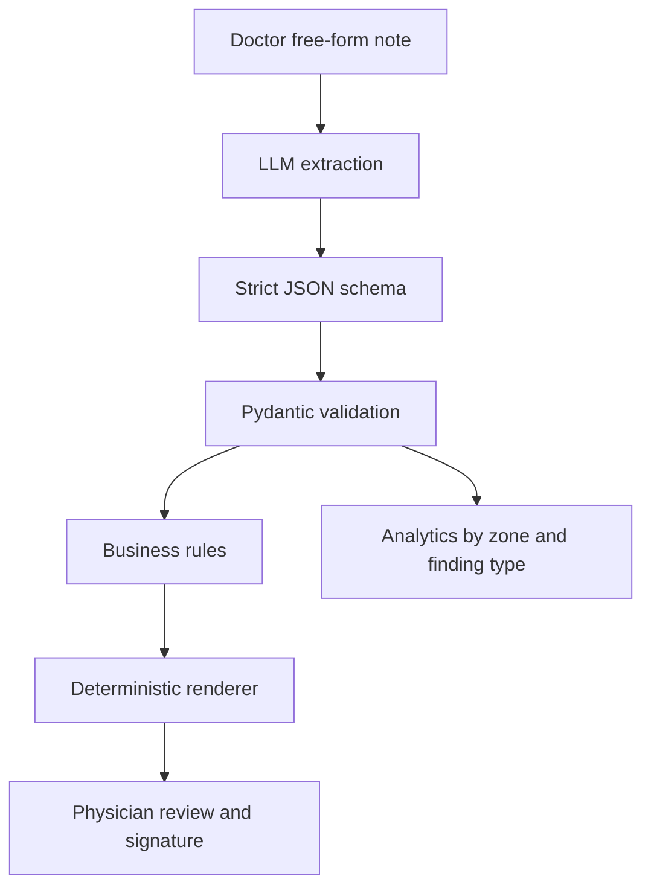

# Endo AI Assistant

AI-assisted endoscopy report structuring prototype.

This project turns a doctor's free-form endoscopy note into a typed, validated
report model, then renders the final text deterministically for physician review.
It is intentionally built as an AI engineering prototype, not as a diagnostic
medical device: the model extracts and structures what the doctor wrote, while
the doctor remains the author who reviews and signs the report.

## Why This Project Exists

Endoscopy reports are often slow to enter because the most valuable part of the
document, the anatomical findings section, is dynamic and does not fit well into
static templates.

The product idea is narrow by design:

1. A physician enters or dictates a free-form description.
2. An LLM extracts structured findings into a strict schema.
3. Python validation rejects unsupported or untraceable data.
4. A deterministic renderer produces the report text.
5. The physician reviews, edits, and signs.

The same structured data also enables per-zone and per-finding analytics, which
is hard to get from raw prose.

## What This Demonstrates

This repository is meant to show the transition from backend engineering to AI
engineering in a concrete, production-shaped problem.

Backend engineering carried over:

- typed domain models and explicit trust boundaries;
- deterministic business logic instead of prompt-only behavior;
- validation, CLI workflows, local testability, and clean module boundaries;
- provider abstraction instead of hard-coding the app around one SDK.

AI engineering added:

- structured-output extraction with strict JSON schema;
- prompt contracts grounded in domain nomenclature;
- evidence traceability for every extracted observation;
- eval cases with precision/recall-style reporting;
- human-in-the-loop safety design;
- privacy-aware deployment path: synthetic data in development, self-hosted or
  de-identified inference for real clinical data.

## Current Capabilities

- Gastroscopy and colonoscopy report schema.
- Real-world draft nomenclature for anatomical zones and finding types.
- Russian labels and multilingual synonyms for extraction guidance.
- Pydantic validation for enum consistency, plausible measurements, required
  text, and source evidence.
- OpenAI structured-output adapter behind a provider-neutral interface.
- Offline synthetic extractor for deterministic demos and tests.
- Deterministic Russian report renderer.
- Review flags for fields a physician should verify.
- Local analytics by anatomical zone and finding type.
- Synthetic eval harness with missing/extra observation diffs.
- Minimal local web prototype for demo purposes.

## Architecture



The LLM is allowed to map prose to structure, but not to invent clinical facts.
Fields that are not present in the doctor's input remain `null`.

## Safety Constraints

The most important design choice is that clinical truth is not delegated to the
model.

- Every observation has `evidence_text`, and validation checks that it appears in
  the original input.
- Anatomical zones and finding types are closed enums, not arbitrary strings.
- Measurements are optional and range-checked.
- The renderer is deterministic and does not call an LLM.
- The output is a draft for physician review, not an autonomous conclusion.
- Real patient data must not be sent to third-party APIs during development.

## Quick Demo

```bash
python3 -m venv .venv
.venv/bin/python -m pip install -r requirements.txt
PYTHONPATH=src .venv/bin/python -m endo_ai_assistant.cli --demo --stats
```

Example output:

```text
Исследование: ЭГДС
Повод: не указано

Описание:
- Антральный отдел: Эрозия с фибринозным налетом. Локализация: по малой кривизне. Размер: 3 мм.
- Луковица ДПК: Язвенный дефект без признаков активного кровотечения. Локализация: не указана. Размер: 6 мм.

Поля для вычитки:
- [warning] Луковица ДПК: Не указана точная локализация находки.

Статистика:
- Зон с находками: 2
- Всего находок: 2
- По зонам:
  - Антральный отдел: 1
  - Луковица ДПК: 1
- По типам:
  - эрозия: 1
  - язва: 1
```

## Local Web Prototype

```bash
PYTHONPATH=src .venv/bin/python -m endo_ai_assistant.web_app --host 127.0.0.1 --port 8787
```

Then open:

```text
http://127.0.0.1:8787
```

The UI is deliberately simple. The important part of this project is the
extraction pipeline, validation layer, deterministic renderer, and eval loop.

## OpenAI Structured Output

The live provider path is optional. The repository can be run and tested without
an API key using the synthetic extractor.

```bash
OPENAI_API_KEY=... PYTHONPATH=src .venv/bin/python -m endo_ai_assistant.cli \
  --provider openai \
  --text "ЭГДС. В антральном отделе желудка эрозия до 3 мм."
```

Use `--model` to override the configured default model:

```bash
OPENAI_API_KEY=... PYTHONPATH=src .venv/bin/python -m endo_ai_assistant.cli \
  --provider openai \
  --model your-model-name \
  --text "..."
```

## Eval

Run the synthetic eval set:

```bash
PYTHONPATH=src .venv/bin/python -m endo_ai_assistant.cli --eval eval_cases/synthetic_endoscopy.json
```

Current result:

```text
Eval summary
Cases: 6/6 passed
Observation recall: 100.00%
Observation precision: 100.00%
```

The eval output includes missing and extra observation diffs when a case fails,
so provider regressions can be inspected without reading raw JSON.

Run a live smoke test against the provider using only synthetic eval data:

```bash
OPENAI_API_KEY=... PYTHONPATH=src .venv/bin/python -m endo_ai_assistant.cli \
  --provider openai \
  --live-smoke
```

If the key or SDK setup is missing, the CLI exits before sending any request and
prints a short setup error.

## Useful Commands

Export the extraction schema:

```bash
PYTHONPATH=src .venv/bin/python -m endo_ai_assistant.cli --schema
```

Export the strict provider schema:

```bash
PYTHONPATH=src .venv/bin/python -m endo_ai_assistant.cli --strict-schema
```

Export the clinical nomenclature:

```bash
PYTHONPATH=src .venv/bin/python -m endo_ai_assistant.cli --nomenclature
```

Inspect the prompts:

```bash
PYTHONPATH=src .venv/bin/python -m endo_ai_assistant.cli --demo --prompt
```

Run tests:

```bash
PYTHONPATH=src:. .venv/bin/python -m unittest
```

## Project Structure

```text
src/endo_ai_assistant/
  models.py          domain enums, Pydantic models, validation rules
  nomenclature.py    labels and synonyms used in prompts and rendering
  extraction.py      extractor protocol and report-building boundary
  llm_extractor.py   provider-neutral LLM extractor
  openai_client.py   OpenAI structured-output adapter
  pipeline.py        shared application pipeline for CLI and web API
  render.py          deterministic Russian report rendering
  quality.py         physician review flags
  analytics.py       per-zone and per-type report statistics
  evaluation.py      synthetic eval loading and scoring
  web_app.py         minimal local HTTP UI
tests/               unit tests for schemas, rendering, eval, CLI, web response
eval_cases/          synthetic eval set, no patient data
```

## Roadmap

- Replace synthetic eval cases with de-identified expert-reviewed examples.
- Add provider A/B evaluation for single-pass vs multi-pass extraction.
- Add RAG for wording suggestions only, not for clinical fact generation.
- Add Docker packaging and basic latency/token/error monitoring.
- Explore self-hosted open-weight inference for hospital-network deployment.

## Status

Prototype/MVP. The repository contains no real patient data.

The goal is to demonstrate AI application engineering on a realistic domain
workflow: structured extraction, validation, eval, safety constraints, and a
clear path from local prototype to privacy-aware deployment.
